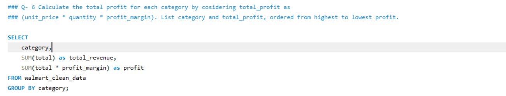
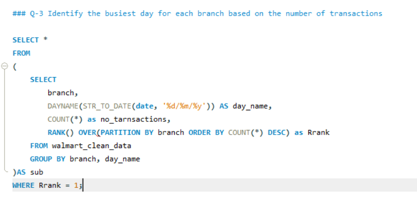
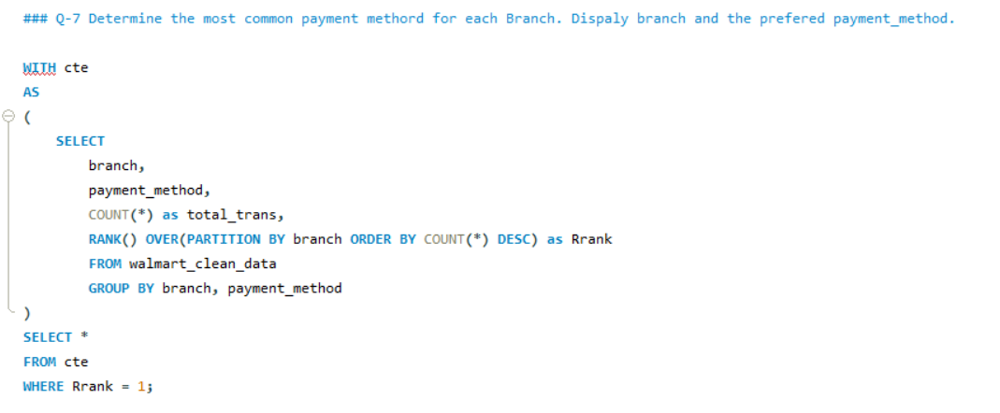

# 🛒 Walmart Sales SQL Analysis

## 📌 Project Overview

This project analyzes Walmart sales data using SQL to extract meaningful business insights. It focuses on customer behavior, product performance, payment trends, and branch-level sales analysis.

---

## 🎯 Business Problems Solved

* Analyze different payment methods and transaction volume
* Identify highest-rated product categories per branch
* Determine busiest days for each branch
* Evaluate sales distribution across different time periods
* Calculate total revenue and profit by category
* Identify branches with declining revenue (2022 vs 2023)

---

## 🗂 Dataset

The dataset includes:

* Branch & City
* Product Category
* Payment Method
* Quantity & Rating
* Date & Time
* Revenue & Profit

---

## 🛠 Tools & Technologies

* SQL (MySQL)
* Jupyter Notebook
* CSV Dataset

---

## 📊 Key Insights

* 💳 Payment preferences vary across branches
* 🏆 Certain product categories consistently perform better
* 📅 Sales patterns differ by day of the week
* ⏰ Afternoon & evening generate more transactions
* 💰 Profit contribution varies by category
* 📉 Some branches show a decline in yearly revenue

---

## 📸 Project Visuals

### 📊 Revenue Analysis

### 🏆 Top Categories by Rating

### 📈 Sales Trend

---

## 🧾 SQL Queries

All SQL queries used for analysis are available in:
`analysis.sql`

---

## 🚀 How to Use

1. Import the dataset into MySQL
2. Run queries from `analysis.sql`
3. Analyze outputs and insights

---

## 💡 Conclusion

This project demonstrates strong SQL skills including:

* Data aggregation
* Window functions
* Common Table Expressions (CTEs)
* Real-world business problem solving

---

## 👩‍💻 Author

**Astha**
Aspiring Data Analyst
